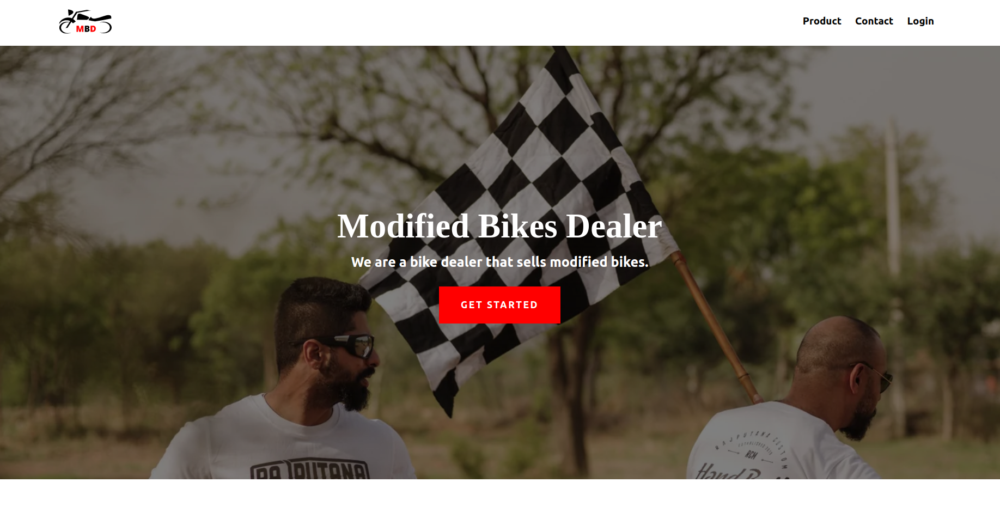
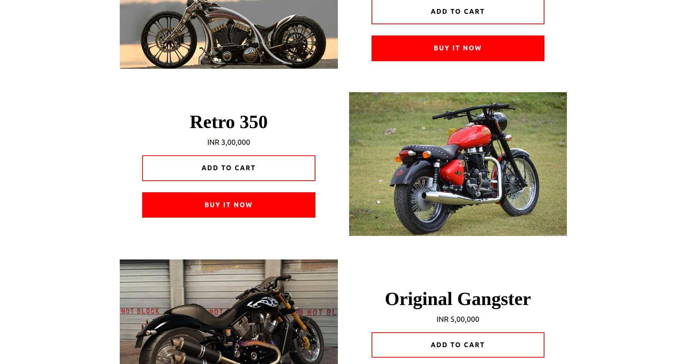

# Modified Bikes Dealer

E-commerce modified bike selling website.
<br>

## Technologies used: 

<p>
    
    
    
    
    
    
</p>

## Images:

Home Page:
<p>
    
    
</p>
<br>
Login Page:
<p>
    
</p>
<br>
Registration Page:
<p>
    
</p>
<br>
Contact Page:
<p>
    
</p>

## How to use:

1. Clone this repo 
```
$ git clone https://github.com/jineshnagori/jinesh-xenonstack.git
```

2. Copy jinesh-xenonstack folder in htdocs folder inside xmapp folder

3. Open XAMPP and start apache and mysql

4. Open phpmyadmin and import the given mbd.sql database.
```
http://localhost/phpmyadmin
```

5. Now open the website
```
http://localhost/mbd
```

6. Now Enjoy the website